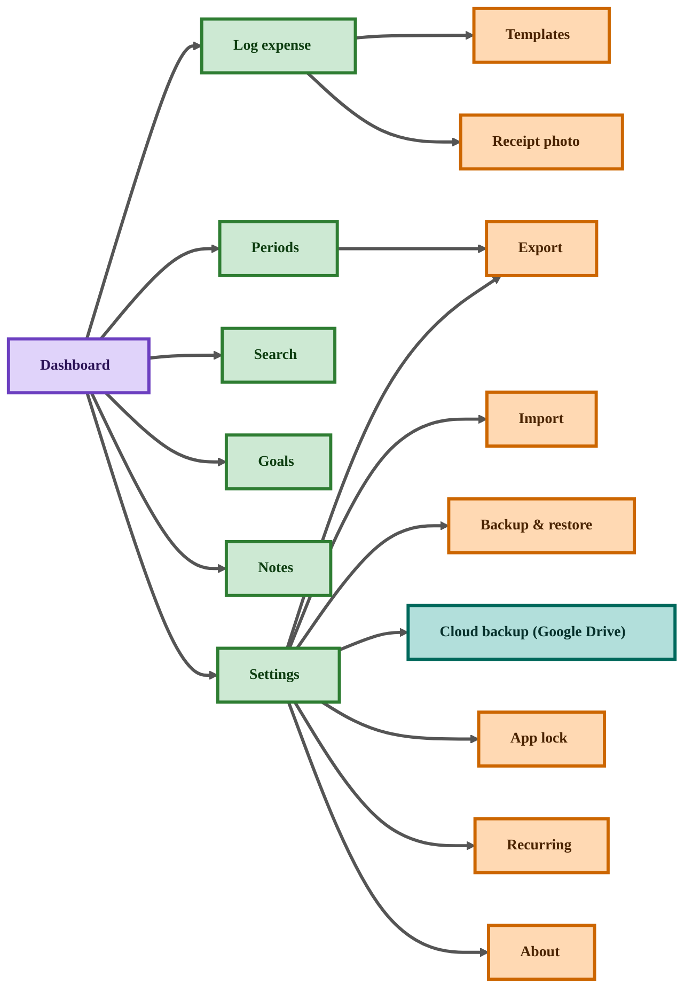

# Expense Tracker — Product Requirements Document (PRD)

|                      |                           |
| -------------------- | ------------------------- |
| **Product**          | Expense Tracker (Android) |
| **Status**           | Pre-implementation        |
| **Technical design** | See [LLD.md](LLD.md)      |

---

## 1. Product overview

### 1.1 Vision

A personal expense tracker that makes logging spending fast, keeps data on the device by default, and helps users understand patterns over time through dashboards, period views, charts, budgets, and insights.

### 1.2 Problem

People forget what they spent, struggle to categorize spending, and lack a simple offline-first tool to review weekly/monthly totals, find past transactions, and stay within budget without spreadsheets.

### 1.3 Solution

Android app (Java + XML) for fast manual expense logging first, with local persistence, summaries, search, history, charts, and CSV export/import. Phased additions: rich capture (voice, templates, recurring, receipts), live import, reminders, budgets, savings goals, plus privacy (app lock), full local backup/restore, and cloud backup to the user's Google account (Google Drive).

### 1.4 Goals

- Log an expense in under a minute (manual form, templates, recurring).
- Show today / week / month totals and category charts on a dashboard.
- Find any past expense quickly via search and filters.
- Keep transaction data on-device; survive app restart; allow full backup/restore.
- Let users back up and restore their data to their own Google account (Google Drive).
- Protect financial data with an optional app lock.
- Design for future cloud sync and storage switching without rewriting UX.

### 1.5 Non-goals (current phases)

- Multi-user cloud accounts, real-time multi-device sync, and household sync (future). Single-user cloud **backup/restore** to the user's own Google Drive **is** in scope — see F-27.
- Per-person family profiles (`FamilyMember` deferred; use **payee** field).
- Receipt **OCR** / auto-extraction from images (photo attachment only, no parsing).
- Split-bill settlement between multiple people, investment/portfolio tracking, direct bank API integration.
- Automated unit/UI test suite.

See [§14 Upcoming / future features](#14-upcoming--future-features) for ideas planned beyond the current phases.

---

## 2. Actors

| Actor               | Description                                         | Primary needs                                 |
| ------------------- | --------------------------------------------------- | --------------------------------------------- |
| **Individual user** | Person tracking personal expenses and income        | Fast log, dashboard, search, charts, export   |
| **Household user**  | Same device, shared tracking without accounts       | Categories, payee field; family tagging later |
| **System (OS)**     | Android permissions, SAF, biometrics, notifications | Mic, camera, unlock, alerts, file access      |
| **Cloud (Google Drive)** | User's Google (Gmail) account and Drive storage for backups | Sign-in, upload/download backups, quota |

No separate admin or self-hosted backend actor; P6 introduces **Google Drive** as an external cloud service for backups.

---

## 3. Delivery phases

| Phase  | Name                   | Summary                                                                          | Target |
| ------ | ---------------------- | -------------------------------------------------------------------------------- | ------ |
| **P1** | Foundation             | Manual log (incl. payment method), dashboard, list, categories, settings, local DB | Now    |
| **P2** | Views, exchange & safety | Period views, charts, search & filter, tags, CSV export/import, backup & restore, app lock, theme & onboarding | Next   |
| **P3** | Rich capture           | Voice, quick-add templates, recurring expenses, receipt photo attachments        | Later  |
| **P4** | Live import & reminders | SMS/notification/clipboard review queue; logging reminders & summary notifications; notes page | Later  |
| **P5** | Intelligence           | Budgets, threshold alerts, insights, savings goals                               | Future |
| **P6** | Cloud backup           | Sign in with Google; back up & restore via Google Drive; optional scheduled cloud backup | Future |

**Later (same patterns):** daily/quarterly/half-yearly period tabs; XLS/PDF export; XLS/other import formats.

---

## 4. Features

| ID   | Feature                  | Phase | Description                                              |
| ---- | ------------------------ | ----- | -------------------------------------------------------- |
| F-01 | Manual expense logger    | P1    | Form: amount, type, category, date/time, optional fields |
| F-02 | Dashboard                | P1    | Today/week/month totals, top categories, recent items    |
| F-03 | Expense list             | P1    | Chronological list; delete; edit (P1 or early P2)        |
| F-04 | Categories               | P1    | Seeded defaults; add/hide/reorder in settings            |
| F-05 | Settings                 | P1    | Default currency and preferences                         |
| F-06 | Local persistence        | P1    | Room SQLite; data survives restart                       |
| F-15 | Payment method           | P1    | Cash / card / UPI / wallet on each expense               |
| F-29 | About & support          | P1    | App info & version; Support / Help and Report-a-bug actions |
| F-07 | Period views             | P2    | Weekly, monthly, yearly totals and breakdowns            |
| F-08 | Export                   | P2    | Plain text and CSV; scope and share/save                 |
| F-09 | Import (file)            | P2    | CSV with preview and confirm                             |
| F-16 | Search & filter          | P2    | Search text; filter by category/type/amount/date/tags    |
| F-17 | Tags / labels            | P2    | Cross-cutting labels in addition to category             |
| F-18 | Charts & visual analytics | P2    | Category pie/bar and spend-trend charts                  |
| F-19 | Backup & restore         | P2    | Full local backup file; restore; optional auto-backup    |
| F-20 | App lock                 | P2    | PIN and/or biometric lock for the app                    |
| F-21 | Theme & onboarding       | P2    | Light/dark/system theme; first-run onboarding            |
| F-10 | Voice log                | P3    | Speech → suggested fields → confirm                      |
| F-22 | Quick-add templates      | P3    | Save and reuse common expenses in one tap                |
| F-23 | Recurring expenses       | P3    | Scheduled auto-generated expenses (rent, subscriptions)  |
| F-24 | Receipt photo attachment | P3    | Attach photos to an expense (no OCR)                     |
| F-11 | Live import queue        | P4    | SMS/notification/clipboard candidates → confirm          |
| F-25 | Reminders & summaries    | P4    | Daily log reminder; weekly/monthly summary notifications |
| F-28 | Notes                    | P4    | Single free-text note (status / about-me); read-only until Edit/Add; Clean to clear |
| F-12 | Budgets                  | P5    | Per category or overall; period caps                     |
| F-13 | Budget alerts            | P5    | Threshold and exceeded notifications                     |
| F-14 | Insights                 | P5    | Rule-based spending messages on dashboard                |
| F-26 | Savings goals            | P5    | Targets with progress tracking                           |
| F-27 | Cloud backup (Google Drive) | P6 | Sign in with Google; upload/restore backup to Drive; optional auto cloud backup |

---

## 5. Functional requirements

### 5.1 Expense record

| ID    | Requirement                                                                      |
| ----- | -------------------------------------------------------------------------------- |
| FR-01 | User can record **amount** (positive) with currency default from settings.       |
| FR-02 | User can set **type**: expense or income.                                        |
| FR-03 | User must select **category** from managed list (not free-text per row).         |
| FR-04 | User can set **date and time** of transaction (editable).                        |
| FR-05 | User can optionally enter **reason**, **payee**, **location** (text), **notes**. |
| FR-06 | System records **source** (manual, voice, import, recurring, etc.) automatically. |
| FR-07 | User can **edit** and **delete** saved expenses.                                 |

### 5.2 Dashboard & list

| ID    | Requirement                                                                |
| ----- | -------------------------------------------------------------------------- |
| FR-08 | Dashboard shows spend totals for **today**, **this week**, **this month**. |
| FR-09 | Dashboard shows **top categories** for current month.                      |
| FR-10 | Dashboard shows **recent transactions** and shortcut to add expense.       |
| FR-11 | List shows all transactions **reverse chronological**.                     |

### 5.3 Categories & settings

| ID    | Requirement                                                      |
| ----- | ---------------------------------------------------------------- |
| FR-12 | App seeds default categories on first run.                       |
| FR-13 | User can change **default currency** in settings.                |
| FR-14 | User can **add**, **hide**, and **reorder** categories (basics). |

### 5.4 Period views (P2)

| ID    | Requirement                                                                                                 |
| ----- | ---------------------------------------------------------------------------------------------------------- |
| FR-15 | User can view **weekly**, **monthly**, **yearly** spending summaries.                                       |
| FR-16 | Period view shows **total**, optional **vs previous period**, **category breakdown**, **transaction list**. |
| FR-17 | Optional setting to include **income** in net totals.                                                      |

### 5.5 Export (P2)

| ID    | Requirement                                                       |
| ----- | ---------------------------------------------------------------- |
| FR-18 | User can export as **CSV** or **plain text**.                     |
| FR-19 | User can choose scope: **all**, **current period**, **custom range**. |
| FR-20 | User can **save** (pick path) or **share** exported file.        |

### 5.6 Import file (P2)

| ID    | Requirement                                                                |
| ----- | -------------------------------------------------------------------------- |
| FR-21 | User can import **CSV** aligned with export columns.                        |
| FR-22 | App shows **preview**: valid count, row-level errors before save.          |
| FR-23 | Nothing imported until user **confirms**; imported rows use source IMPORT. |
| FR-24 | Invalid rows are reported; not saved silently.                             |

### 5.7 Payment method (P1 field, P2 analytics)

| ID    | Requirement                                                                          |
| ----- | ------------------------------------------------------------------------------------ |
| FR-36 | User can set a **payment method** (cash, card, UPI, wallet, other) on an expense.     |
| FR-37 | User can set a **default payment method**; it pre-fills the logger.                   |
| FR-38 | User can filter and break down spending by payment method (P2).                      |

### 5.8 Search & filter (P2)

| ID    | Requirement                                                                                  |
| ----- | ------------------------------------------------------------------------------------------- |
| FR-39 | User can **search** expenses by text across reason, payee, and notes.                         |
| FR-40 | User can **filter** by category, type, payment method, tags, amount range, and date range.    |
| FR-41 | User can **sort** results (by date or amount).                                               |
| FR-42 | Search/filter results show a running **total** of matched expenses.                          |

### 5.9 Tags / labels (P2)

| ID    | Requirement                                                          |
| ----- | ------------------------------------------------------------------- |
| FR-43 | User can add one or more **tags** to an expense.                     |
| FR-44 | User can filter and total spending by **tag**.                       |
| FR-45 | Tags are reusable; app suggests existing tags while typing.          |

### 5.10 Charts & visual analytics (P2)

| ID    | Requirement                                                                       |
| ----- | -------------------------------------------------------------------------------- |
| FR-46 | Dashboard and period views show a **category breakdown** chart (pie or bar).      |
| FR-47 | User can view a **spend trend** over time (e.g. by day/week/month).               |
| FR-48 | Charts respect the active period/scope and update when data changes.              |

### 5.11 Backup & restore (P2)

| ID    | Requirement                                                                              |
| ----- | --------------------------------------------------------------------------------------- |
| FR-49 | User can create a **full backup** file containing all transactions, categories, settings. |
| FR-50 | User can **restore** from a backup file, with confirmation (replace or merge).           |
| FR-51 | User can enable optional **scheduled auto-backup** to a chosen location.                  |
| FR-52 | Restore validates the file and reports errors without corrupting existing data.          |

### 5.12 App lock (P2)

| ID    | Requirement                                                                       |
| ----- | -------------------------------------------------------------------------------- |
| FR-53 | User can enable **app lock** using a PIN and/or **biometric** (fingerprint/face). |
| FR-54 | App requires unlock on launch and after a configurable background timeout.        |
| FR-55 | **PIN fallback** is available when biometric fails or is unavailable.             |

### 5.13 Theme & onboarding (P2)

| ID    | Requirement                                                            |
| ----- | --------------------------------------------------------------------- |
| FR-56 | User can choose **light / dark / system** theme.                       |
| FR-57 | First-run **onboarding** explains logging and confirms seeded defaults. |

### 5.14 Voice (P3)

| ID    | Requirement                                                               |
| ----- | ------------------------------------------------------------------------ |
| FR-25 | User can record voice; app shows transcript and **suggested** fields.     |
| FR-26 | User must **confirm** on logger form before save; original text retained. |

### 5.15 Quick-add templates (P3)

| ID    | Requirement                                                                |
| ----- | ------------------------------------------------------------------------- |
| FR-58 | User can save an expense (or build one) as a **template / favorite**.       |
| FR-59 | User can create an expense from a template in one or two taps.             |
| FR-60 | User can edit and delete templates.                                        |

### 5.16 Recurring expenses (P3)

| ID    | Requirement                                                                                      |
| ----- | ----------------------------------------------------------------------------------------------- |
| FR-61 | User can define a **recurring rule** (amount, category, schedule, start, optional end).           |
| FR-62 | System **generates** due recurring expenses automatically (or prompts), source = RECURRING.       |
| FR-63 | Generation is **idempotent** — no duplicates if the app opens late; missed dates are caught up.    |
| FR-64 | User can **pause / stop / edit** a rule; already-generated expenses remain normal editable items.  |

### 5.17 Receipt photo (P3)

| ID    | Requirement                                                            |
| ----- | --------------------------------------------------------------------- |
| FR-65 | User can attach one or more **photos** (camera or gallery) to an expense. |
| FR-66 | User can **view** and **remove** attachments; images stored locally.    |
| FR-67 | No OCR/parsing — attachments are reference images only.                |

### 5.18 Reminders & summaries (P4)

| ID    | Requirement                                                           |
| ----- | -------------------------------------------------------------------- |
| FR-68 | User can enable a **daily reminder** to log expenses (configurable time). |
| FR-69 | User can enable **weekly/monthly summary** notifications.             |
| FR-70 | Reminders respect notification permission and can be turned off.      |

### 5.19 Live import (P4)

| ID    | Requirement                                                          |
| ----- | ------------------------------------------------------------------- |
| FR-27 | Incoming hints (SMS, notification, clipboard) enter **review queue**. |
| FR-28 | No auto-save without user confirmation.                              |

### 5.20 Budgets & intelligence (P5)

| ID    | Requirement                                                             |
| ----- | ---------------------------------------------------------------------- |
| FR-29 | User can define budget by **category** or **overall** for a **period**. |
| FR-30 | User receives alert at **threshold** (e.g. 80%) and when **exceeded**.  |
| FR-31 | Dashboard can show **insights** (e.g. category spend vs last month).    |

### 5.21 Savings goals (P5)

| ID    | Requirement                                                                |
| ----- | ------------------------------------------------------------------------- |
| FR-71 | User can create a **savings goal** (target amount, optional target date).   |
| FR-72 | App tracks and displays **progress** toward each goal.                     |
| FR-73 | User can edit, complete, or delete goals.                                  |

### 5.22 Data & validation

| ID    | Requirement                                                               |
| ----- | ------------------------------------------------------------------------ |
| FR-32 | Amount must be **> 0**; category required; date not far in future.        |
| FR-33 | Text fields have max length; errors shown on form.                       |
| FR-34 | Data is **local-first**; settings separate from transactions.            |
| FR-35 | User should **export or back up** before storage migration or cloud enable (future). |

### 5.23 Cloud backup (P6)

| ID    | Requirement                                                                                       |
| ----- | ------------------------------------------------------------------------------------------------ |
| FR-74 | User can connect (sign in to) their **Google account** to enable cloud backup.                    |
| FR-75 | User can **upload / back up** all data (transactions, categories, tags, settings) to **Google Drive**. |
| FR-76 | User can **restore** from the latest or a chosen Drive backup, with confirmation (replace or merge). |
| FR-77 | User can run cloud backup **on demand** and enable **automatic** backup on a schedule (e.g. daily/weekly). |
| FR-78 | App shows **last backup time, account, and status**; user can **sign out / disconnect** the account. |
| FR-79 | Cloud backup requires **internet**; on failure (no network, expired auth, quota exceeded) the error is reported and the **last good backup is preserved**. |
| FR-80 | Backups are stored in the user's **own Drive** (app-private folder by default); minimal Drive scope is requested and the user is warned the data is **sensitive**. |

### 5.24 Notes (P4)

| ID    | Requirement                                                                          |
| ----- | ----------------------------------------------------------------------------------- |
| FR-81 | The Notes page shows a single free-text note (like a personal status / "about me"), **read-only (disabled) by default**. |
| FR-82 | From the top-right **overflow menu ("…")**: **Edit / Add** enables editing; **Clean** clears the note. |
| FR-83 | The note is saved **locally** and persists across restart.                            |

### 5.25 About & support (P1)

| ID    | Requirement                                                                                       |
| ----- | ------------------------------------------------------------------------------------------------ |
| FR-84 | App provides an **About** page (from Settings) showing the **app name**, **icon**, and a short **description**. |
| FR-85 | About shows the **app version** and **build number** (from the build config).                      |
| FR-86 | User can open **Support / Help** from About (e.g. email to the support address) to get assistance. |
| FR-87 | User can **Report a bug** from About; the report pre-fills **app version and device info** and **excludes** personal financial data. |
| FR-88 | About may link to the **privacy policy** and **open-source licenses / acknowledgements**.          |

---

## 6. Use cases

### UC-01 — Log expense manually

|                   |                                             |
| ----------------- | ------------------------------------------- |
| **Actor**         | Individual user                             |
| **Preconditions** | App installed; at least one category exists |
| **Trigger**       | User opens Log expense or FAB on dashboard  |

**Main flow**

1. User enters amount, category, type, date/time, payment method.
2. User optionally enters reason, payee, location, tags, notes.
3. User taps Save.
4. System validates and persists record.
5. Dashboard and list reflect new expense.

**Alternates**

- A1: Validation fails → show field errors; no save.
- A2: User cancels → no save.

---

### UC-02 — View dashboard

|                   |                 |
| ----------------- | --------------- |
| **Actor**         | Individual user |
| **Preconditions** | App open        |

**Main flow**

1. User opens Dashboard tab.
2. System shows totals, category chart, top categories, recent items.

---

### UC-03 — Delete expense

|                   |                             |
| ----------------- | --------------------------- |
| **Actor**         | Individual user             |
| **Preconditions** | At least one expense exists |

**Main flow**

1. User opens expense list.
2. User deletes an item.
3. Totals and charts update.

---

### UC-04 — Review period spending (P2)

|                   |                 |
| ----------------- | --------------- |
| **Actor**         | Individual user |
| **Preconditions** | P2 delivered    |

**Main flow**

1. User opens Periods tab.
2. User selects Weekly, Monthly, or Yearly.
3. System shows period total, chart, breakdown, transaction list.

---

### UC-05 — Export data (P2)

|           |                 |
| --------- | --------------- |
| **Actor** | Individual user |

**Main flow**

1. User opens export from Settings or Periods.
2. User picks format (CSV or plain text) and scope.
3. User saves or shares file.

---

### UC-06 — Import from CSV (P2)

|           |                 |
| --------- | --------------- |
| **Actor** | Individual user |

**Main flow**

1. User opens import in Settings.
2. User picks CSV file.
3. System parses and shows preview (valid/errors).
4. User confirms.
5. System saves valid rows; list and dashboard update.

**Alternates**

- A1: User cancels preview → no rows saved.

---

### UC-10 — Search & filter expenses (P2)

|           |                 |
| --------- | --------------- |
| **Actor** | Individual user |

**Main flow**

1. User opens search.
2. User types text and/or applies filters (category, type, payment method, tags, amount, date).
3. System shows matching expenses and a running total.
4. User opens an item to view or edit.

---

### UC-11 — Back up and restore (P2)

|           |                 |
| --------- | --------------- |
| **Actor** | Individual user |

**Main flow**

1. User opens Backup in Settings.
2. User creates a backup → picks a location → file written.
3. To restore: user selects a backup file → confirms replace/merge.
4. System validates and applies; data refreshes.

**Alternates**

- A1: Invalid/corrupt file → error shown; existing data untouched.

---

### UC-12 — Enable app lock (P2)

|           |                 |
| --------- | --------------- |
| **Actor** | Individual user |

**Main flow**

1. User enables app lock in Settings; sets a PIN.
2. User optionally enables biometric.
3. On next launch/resume after timeout, app requires unlock.

**Alternates**

- A1: Biometric fails → PIN fallback.

---

### UC-07 — Voice log (P3)

|                   |                               |
| ----------------- | ----------------------------- |
| **Actor**         | Individual user               |
| **Preconditions** | Microphone permission granted |

**Main flow**

1. User records expense by voice.
2. System shows transcript and suggested fields on logger form.
3. User edits if needed and confirms.
4. System saves with source VOICE and raw transcript.

---

### UC-13 — Create expense from template (P3)

|           |                 |
| --------- | --------------- |
| **Actor** | Individual user |

**Main flow**

1. User selects a saved template.
2. System pre-fills the logger (amount, category, etc.).
3. User adjusts date/amount if needed and saves.

---

### UC-14 — Set up recurring expense (P3)

|           |                 |
| --------- | --------------- |
| **Actor** | Individual user |

**Main flow**

1. User creates a recurring rule (amount, category, schedule, start/end).
2. On each due date, system generates the expense (source RECURRING).
3. User can pause, edit, or stop the rule anytime.

**Alternates**

- A1: App opened after several due dates → system catches up without duplicates.

---

### UC-15 — Attach receipt photo (P3)

|                   |                            |
| ----------------- | -------------------------- |
| **Actor**         | Individual user            |
| **Preconditions** | Camera permission if using camera |

**Main flow**

1. While logging/editing, user attaches a photo (camera or gallery).
2. System stores the image locally and links it to the expense.
3. User can view or remove it later.

---

### UC-08 — Review live import (P4)

|           |                 |
| --------- | --------------- |
| **Actor** | Individual user |

**Main flow**

1. System receives candidate (SMS, notification, clipboard).
2. Item appears in review queue.
3. User opens pre-filled form, confirms or rejects.

---

### UC-09 — Manage budget (P5)

|           |                 |
| --------- | --------------- |
| **Actor** | Individual user |

**Main flow**

1. User creates budget (category or overall, period, amount, threshold).
2. System evaluates spend against budget.
3. User receives notification when threshold or exceed triggered.

---

### UC-16 — Track a savings goal (P5)

|           |                 |
| --------- | --------------- |
| **Actor** | Individual user |

**Main flow**

1. User creates a goal (target amount, optional date).
2. App shows progress over time.
3. User marks the goal complete when reached.

---

### UC-17 — Back up to Google Drive (P6)

|                   |                                                |
| ----------------- | ---------------------------------------------- |
| **Actor**         | Individual user                                |
| **Preconditions** | Internet available; Google account for sign-in |

**Main flow**

1. User opens **Cloud backup** in Settings.
2. User signs in with their **Google (Gmail) account** and grants Drive access.
3. User taps **Back up now**; app uploads data to Google Drive.
4. App shows success with **last-backup time** and account.
5. (Optional) User enables **automatic cloud backup** on a schedule.

**Restore**

6. On a new install/device, user signs in and selects **Restore from cloud** → confirms replace/merge → data applied.

**Alternates**

- A1: No network → error shown; last good backup preserved; user retries later.
- A2: Auth/session expired → app prompts re-sign-in.
- A3: Drive quota exceeded → error explains; user frees space or removes old backups.

---

### UC-18 — View / edit the note (P4)

|                   |                           |
| ----------------- | ------------------------- |
| **Actor**         | Individual user           |
| **Preconditions** | App installed             |
| **Trigger**       | User opens the Notes page |

**Main flow**

1. User opens the **Notes** page; the note is shown **read-only** (editing disabled).
2. User taps **Edit / Add** from the top-right "…" menu; the field becomes editable.
3. User types and saves; the note is stored and shown read-only again.

**Overflow menu ("…", top right)**

- **Edit / Add** → enables editing of the note.
- **Clean** → clears the note.

**Alternates**

- A1: User makes no change → the note is unchanged.

---

### UC-19 — View About / get support (P1)

|                   |                                |
| ----------------- | ------------------------------ |
| **Actor**         | Individual user                |
| **Preconditions** | App installed                  |
| **Trigger**       | User opens About from Settings |

**Main flow**

1. User opens **About** from Settings.
2. System shows app name, icon, description, and **version / build number**.
3. User can tap **Support / Help** → composes an email to support.
4. User can tap **Report a bug** → composes an email pre-filled with app version and device info (no financial data).

**Alternates**

- A1: No email app available → app shows the support address to copy, or an alternate contact.

---

## 7. Screens and navigation

| Screen          | Purpose                                                              |
| --------------- | ------------------------------------------------------------------- |
| Dashboard       | Summaries, category chart, recent activity, add expense             |
| Log expense     | Manual form (payment method, tags, photo); reuse after voice/import |
| Periods         | Time-based views with charts (P2)                                   |
| Search          | Search and filter expenses (P2)                                     |
| Settings        | Currency, categories, theme, export/import, backup, **cloud backup**, app lock, templates, recurring, budgets, goals |
| Goals           | Savings goals and progress (P5)                                     |
| Notes           | Single free-text note (status/about-me); read-only until Edit/Add (P4) |
| About           | App info & version; Support / Help and Report a bug (P1)            |

**Colour legend**

| Colour | Role                  |
| ------ | --------------------- |
| Purple | Hub (Dashboard)       |
| Green  | Main screen           |
| Orange | Sub-flow / action     |
| Teal   | New — cloud backup    |

---

## 8. Expense data (user view)

| Field          | Required | Notes                                   |
| -------------- | -------- | --------------------------------------- |
| Amount         | Yes      | Positive; default currency              |
| Type           | Yes      | Expense or income                       |
| Category       | Yes      | From managed list                       |
| Date & time    | Yes      | When transaction occurred               |
| Payment method | No       | Cash / card / UPI / wallet / other      |
| Tags           | No       | One or more reusable labels             |
| Reason         | No       | Why                                     |
| Payee          | No       | Who was paid                            |
| Location       | No       | Text place/address                      |
| Notes          | No       | Extra detail                            |
| Photos         | No       | Attached receipt images (P3)            |
| Source         | Auto     | Manual / voice / import / recurring     |

---

## 9. Permissions

| Phase | Permission                    | User impact                          |
| ----- | ----------------------------- | ------------------------------------ |
| P1    | None                          | —                                    |
| P2    | Biometric (optional)          | App lock unlock; SAF used for files (no storage permission) |
| P3    | Microphone; Camera            | Voice logging; receipt photo capture |
| P4    | Notifications; SMS (if used)  | Reminders/summaries; live import     |
| P5    | Notifications                 | Budget alerts                        |
| P6    | Internet; Google Sign-In      | Cloud backup upload/restore to Google Drive |

---

## 10. Acceptance criteria (by phase)

### P1

- [ ] User can log, view, delete expenses; data persists after restart.
- [ ] Dashboard totals match logged data.
- [ ] Default categories seeded; currency and default payment method apply to new entries.
- [ ] About page shows app name, description, and the correct version/build.
- [ ] Support and Report-a-bug actions open an email with app/version info; no financial data is attached.

### P2

- [ ] Period tabs show correct ranges, totals, and charts.
- [ ] Export produces valid CSV/TXT; import preview works; confirmed import appears in app.
- [ ] Search and filters return correct results with a running total.
- [ ] Backup file can be created and restored without data loss.
- [ ] App lock requires unlock; PIN fallback works; theme switch applies.

### P3

- [ ] Voice/template/recurring entries save correctly with proper source.
- [ ] Recurring generation is idempotent (no duplicates) and catches up missed dates.
- [ ] Photos attach, display, and remove; survive restart.

### P4

- [ ] Live import candidates require confirmation.
- [ ] Reminders/summaries fire per settings and can be disabled.
- [ ] Note is read-only by default; Edit/Add enables editing; Clean clears it; the note persists after restart.

### P5

- Per features F-12 through F-14, F-26 and use cases UC-09, UC-16.

### P6

- [ ] User can sign in with a Google account and back up data to Google Drive.
- [ ] User can restore data from a Drive backup on a fresh install; data matches.
- [ ] Automatic cloud backup runs per schedule; last backup time, account, and status are shown.
- [ ] Failures (no network, expired auth, quota) are handled gracefully; last good backup is preserved.
- [ ] User can sign out / disconnect the Google account.

---

## 11. Manual verification checklist

- Log expense (with payment method, tags) → dashboard, charts, and list update.
- Edit/delete → totals and charts update.
- About page shows correct version/build; Support and Report-a-bug open an email with app/device info, no financial data (P1).
- Search/filter → correct matches and running total (P2).
- Period views and charts correct (P2).
- Export/import CSV with special characters (P2).
- Backup → restore on fresh install → data matches (P2).
- App lock → relock after timeout; PIN fallback (P2).
- Recurring rule generates expected items without duplicates (P3).
- Receipt photo attaches and persists (P3).
- Notes: read-only by default; Edit/Add → type → save persists; Clean clears it (P4).
- Cloud backup → sign in with Google → upload succeeds; last-backup time and account update (P6).
- Restore from Google Drive on a fresh install → data matches (P6).
- Toggle automatic cloud backup; scheduled run completes (P6).
- Airplane mode → cloud backup shows a clear error and preserves the last good backup, no crash (P6).
- Storage migration count match when offered (future).

---

## 12. Risks and mitigations

| Risk                          | Mitigation                                              |
| ----------------------------- | ------------------------------------------------------ |
| Voice/SMS extraction wrong    | Always require user confirmation                       |
| Play Store SMS restrictions   | Clipboard / manual paste fallback                      |
| Data loss on storage switch   | Export/backup first; transactional migration           |
| Family attribution            | Payee field until family/cloud phase                   |
| Recurring duplicates / misses | Idempotent generation keyed by due date; catch-up logic |
| Receipt photo storage growth  | Compress images; allow delete; count toward backup size |
| Biometric unavailable         | Mandatory PIN fallback                                  |
| Backup file is sensitive      | Warn it is unencrypted (unless encrypted storage); advise safe location |
| Cloud backup holds sensitive data | Store in app-private Drive folder; request minimal scope; warn user; consider encryption |
| Google auth/token expiry or revoke | Detect and prompt re-sign-in; retry with backoff; surface status |
| Network failure mid-upload    | Resumable/atomic upload; verify before replacing the last good backup |
| Wrong account on restore      | Confirm signed-in account; validate backup ownership and format before applying |

---

## 13. Out of scope / deferred

- `FamilyMember` profiles and per-person tagging
- Real-time multi-device cloud **sync** and multi-user accounts (architecture prepared in LLD). Single-user cloud **backup/restore** to the user's own Google Drive is in scope — see F-27 / §5.23.
- Receipt OCR / auto-extraction; split-bill settlement; investment tracking; bank API
- XLS/PDF export; non-CSV import (except P2 CSV)

---

## 14. Upcoming / future features

Planned beyond the current phases (not yet specified in detail):

- **Accounts / wallets + transfers** — track balances per account (cash, bank, card) and move money between them.
- **Home-screen widget / quick shortcut** — log an expense without opening the app.

---
