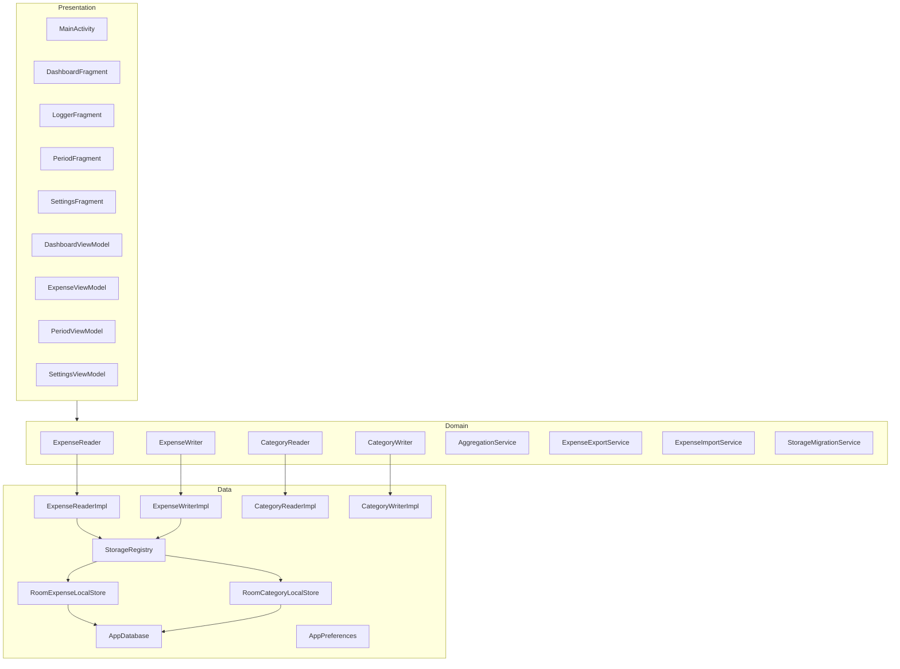
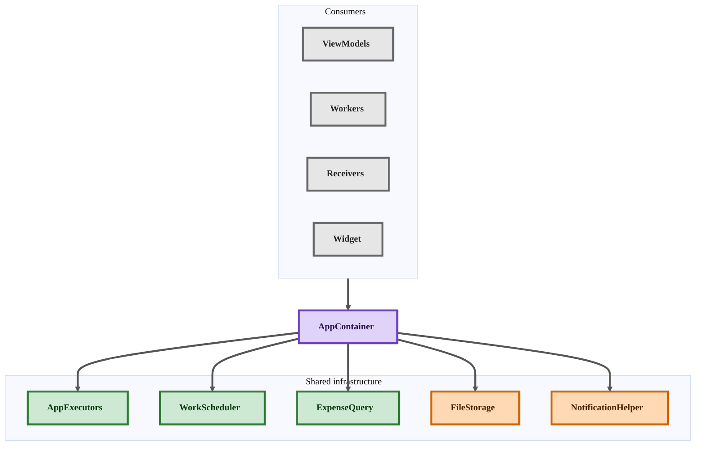
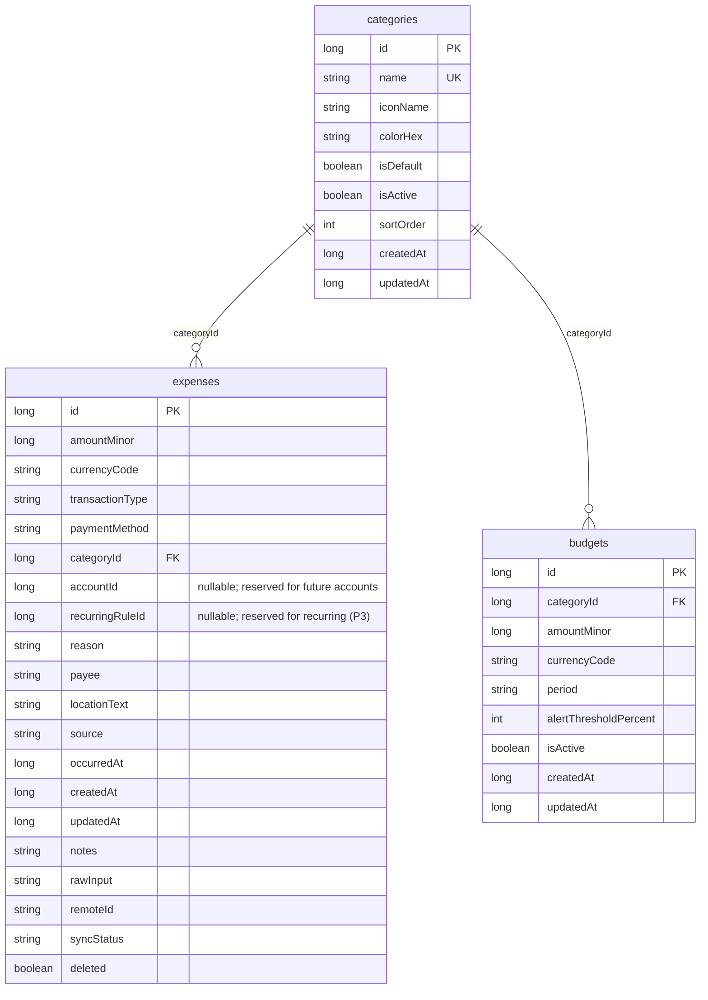

# Expense Tracker — Low-Level Design (LLD)


|                          |                                |
| ------------------------ | ------------------------------ |
| **Product requirements** | [prd.md](prd.md)               |
| **Status**               | Pre-implementation             |
| **Package**              | `com.hitstudio.expensetracker` |
|                          |                                |


This document describes **how** the app is built: components, interfaces, data, and build order. Update individual component sections when implementation changes.

**Stack:** Java · XML Views · Room (SQLite) · local-first · swappable storage

---

## 1. Architecture overview




### 1.1 Layer rules

1. **ISP:** Read/observe and write/CRUD are **separate interfaces** at repository and local-store layers.
2. ViewModels depend only on the **reader/writer interfaces** and **services** they need — never Room or HTTP.
3. One Room class per entity family may implement both local reader and writer (e.g. `RoomExpenseLocalStore`).
4. `StorageRegistry` supplies active local reader/writer pairs from `StorageMode`.
5. File I/O: `ExpenseExportService` → `ExpenseReader`; `ExpenseImportService` → `ExpenseWriter` + `CategoryReader`.

### 1.2 Package map (`com.hitstudio.expensetracker`)


| Package             | Role                                                                         |
| ------------------- | ---------------------------------------------------------------------------- |
| `ui.`*              | Fragments, adapters, dialog state                                            |
| `domain.model`      | Models, enums, value objects                                                 |
| `domain.repository` | `ExpenseReader`, `ExpenseWriter`, `CategoryReader`, `CategoryWriter`         |
| `domain.service`    | Aggregation, export/import orchestration, migration, budgets                 |
| `data.repository`   | Repository implementations                                                   |
| `data.local`        | Local store interfaces, `StorageRegistry`                                    |
| `data.local.room`   | Room DB, entities, DAOs, store implementations                               |
| `data.prefs`        | `AppPreferences`, `AppSettings`                                              |
| `data.security`     | `AppLockManager`, encrypted PIN storage                                      |
| `data.file`         | `FileStorage` (SAF wrapper) for export / backup / attachments                |
| `data.remote`       | (future) cloud sync                                                          |
| `export`            | `ExpenseExporter` plugins                                                    |
| `import`            | `ExpenseImporter` plugins                                                    |
| `work`              | `WorkScheduler` + WorkManager workers (recurring, reminders, backup, alerts) |
| `notify`            | `NotificationHelper`, channels                                               |
| `util`              | `PeriodHelper`, formatters                                                   |
| `util.concurrent`   | `AppExecutors`, `Result` / `Resource<T>`                                     |
| `app`               | `AppContainer` (ServiceLocator) wiring repos / services / workers            |


### 1.3 Cross-cutting infrastructure (P1 foundation)

Several later features (search, recurring, reminders, backup, alerts, the future widget) will run outside an Activity and will share the same seams; these are introduced in P1 so feature phases add code without reworking existing components.

- `**AppContainer`**: app-scoped ServiceLocator that will own and hand out repositories, services, executors, the scheduler, and file/notification helpers to ViewModels, Workers, receivers, and the future widget.
- `**AppExecutors` + `Result<T>`/`Resource<T>`**: blocking reads/writes will run on a shared executor and return a `Result`/`Resource` wrapper; LiveData remains the observe channel.
- `**WorkScheduler**`: thin WorkManager wrapper that schedules recurring generation, the daily expense reminder, auto-backup, and budget evaluation.
- `**FileStorage**`: Storage Access Framework wrapper that will create/open documents and hold persisted tree URIs for export, backup, and receipt attachments.
- `**NotificationHelper**`: owns notification channels and reminder notifications; summaries and budget alerts can reuse it later.
- `**ExpenseQuery**`: criteria value object that, with Room `@RawQuery`, will back search, every filter dimension, and payment-method/tag breakdowns — so new filters add no new interface methods.

**Colour legend**


| Colour | Role                       |
| ------ | -------------------------- |
| Purple | App wiring / orchestration |
| Green  | Concurrency & scheduling   |
| Amber  | File & notification I/O    |
| Gray   | Consumers                  |





---

## 2. Component catalog


| Component                                               | Layer       | Phase   | Section |
| ------------------------------------------------------- | ----------- | ------- | ------- |
| `MainActivity`                                          | UI          | P1      | §3.1    |
| `DashboardFragment` / `DashboardViewModel`              | UI          | P1      | §3.2    |
| `LoggerFragment` / `ExpenseViewModel`                   | UI          | P1      | §3.3    |
| Expense list UI                                         | UI          | P1      | §3.4    |
| `PeriodFragment` / `PeriodViewModel`                    | UI          | P2      | §3.5    |
| `SettingsFragment` / `SettingsViewModel`                | UI          | P1      | §3.6    |
| Export / Import dialogs                                 | UI          | P2      | §3.7    |
| `ExpenseReader` / `ExpenseReaderImpl`                   | Domain/Data | P1      | §4.1    |
| `ExpenseWriter` / `ExpenseWriterImpl`                   | Domain/Data | P1      | §4.2    |
| `CategoryReader` / `CategoryReaderImpl`                 | Domain/Data | P1      | §4.3    |
| `CategoryWriter` / `CategoryWriterImpl`                 | Domain/Data | P1      | §4.4    |
| `AggregationService`                                    | Domain      | P1      | §5.1    |
| `ExpenseExportService`                                  | Domain      | P2      | §5.2    |
| `ExpenseImportService`                                  | Domain      | P2      | §5.3    |
| `StorageMigrationService`                               | Domain      | P1 stub | §5.4    |
| `ExpenseExporter` / `CsvExporter` / `PlainTextExporter` | Export      | P2      | §6.1    |
| `ExpenseImporter` / `CsvExpenseImporter`                | Import      | P2      | §6.2    |
| `StorageRegistry`                                       | Data        | P1      | §7.1    |
| `ExpenseLocalReader` / `ExpenseLocalWriter`             | Data        | P1      | §7.2    |
| `CategoryLocalReader` / `CategoryLocalWriter`           | Data        | P1      | §7.3    |
| `RoomExpenseLocalStore`                                 | Data        | P1      | §7.4    |
| `RoomCategoryLocalStore`                                | Data        | P1      | §7.5    |
| `AppDatabase` + DAOs + entities                         | Data        | P1      | §7.6    |
| `AppPreferences`                                        | Data        | P1      | §7.7    |
| `ExpenseExtractor`                                      | Domain      | P3      | §5.5    |
| `ImportSource`                                          | Domain      | P4      | §5.6    |
| `BudgetService`                                         | Domain      | P5      | §5.7    |
| `PeriodHelper`                                          | Util        | P2      | §8.1    |
| `CsvReader` / `CsvWriter`                               | Util        | P2      | §8.2    |
| `AppContainer` / `AppExecutors` / `Result`              | App         | P1      | §1.3    |
| `WorkScheduler`                                         | Work        | P1      | §1.3    |
| `FileStorage`                                           | Data        | P1      | §7.10   |
| `NotificationHelper`                                    | Util        | P1      | §1.3    |
| `ExpenseReminderWorker`                                 | Work        | P1      | §5.11   |
| `ExpenseQuery` / `ExpenseQueryBuilder`                  | Domain      | P2      | §4.5    |
| `SearchFragment` / `SearchViewModel`                    | UI          | P2      | §3.8    |
| `TagReader` / `TagWriter` (+ store, DAO)                | Domain/Data | P2      | §4.6    |
| Charts (`TrendSeries`, MPAndroidChart views)            | UI/Domain   | P2      | §5.1    |
| `BackupService` / `BackupWorker`                        | Domain/Work | P2      | §5.8    |
| `ThemeController` / `OnboardingActivity`                | UI          | P2      | §3.9    |
| `AppLockManager` / `LockFragment`                       | Data/UI     | P2      | §7.9    |
| `TemplateReader` / `TemplateWriter` (+ store, DAO)      | Domain/Data | P3      | §4.7    |
| Templates UI                                            | UI          | P3      | §3.10   |
| `RecurringRuleReader` / `RecurringRuleWriter`           | Domain/Data | P3      | §4.8    |
| `RecurringExpenseService` / `RecurringWorker`           | Domain/Work | P3      | §5.9    |
| `AttachmentReader` / `AttachmentWriter` (+ store, DAO)  | Domain/Data | P3      | §4.9    |
| `ImportCandidateReader` / `ImportCandidateWriter`       | Domain/Data | P4      | §4.10   |
| `LiveImportService` / `ImportSource` impls              | Domain      | P4      | §5.10   |
| `SummaryWorker`                                         | Work        | P4      | §5.11   |
| `NotesFragment` / `NotesViewModel`                      | UI          | P4      | §3.13   |
| `AboutFragment` (BuildConfig + email intents)           | UI          | P1      | §3.14   |
| `InsightService`                                        | Domain      | P5      | §5.12   |
| `GoalReader` / `GoalWriter` (+ store, DAO)              | Domain/Data | P5      | §4.11   |
| `GoalService` / `GoalsFragment`                         | Domain/UI   | P5      | §5.13   |


---

## 3. Presentation components

### 3.1 MainActivity


|                    |                                                                           |
| ------------------ | ------------------------------------------------------------------------- |
| **Responsibility** | Single activity host; edge-to-edge; `NavHostFragment` + bottom navigation; handles reminder notification deep-links and runtime notification permission |
| **Depends on**     | Navigation graph, theme, `NotificationHelper`                            |
| **Phase**          | P1                                                                        |


Hosts: Dashboard, Logger, Periods (stub P1), Settings; Notes (P4); About (P1).

---

### 3.2 DashboardFragment + DashboardViewModel


|                    |                                                                                                                               |
| ------------------ | ----------------------------------------------------------------------------------------------------------------------------- |
| **Responsibility** | Show today/week/month totals, top categories, recent expenses; FAB → logger; category chart + spend trend (P2); insights (P5) |
| **Depends on**     | `ExpenseReader` (`observeDashboard`, `observeRecent`); `AggregationService` (trend, P2); `InsightService` (P5)                |
| **Phase**          | P1 (totals); P2 (charts); P5 (insights)                                                                                       |


---

### 3.3 LoggerFragment + ExpenseViewModel


|                    |                                                                                                                                           |
| ------------------ | ----------------------------------------------------------------------------------------------------------------------------------------- |
| **Responsibility** | Manual expense form (payment method P1; tags P2; receipt photos P3); validation; save/update; reused for voice/import review              |
| **Depends on**     | `ExpenseWriter`, `CategoryReader`, `AppPreferences`; `TagReader`/`TagWriter` (P2), `AttachmentWriter` (P3); `LoggerFormState` → `Expense` |
| **Phase**          | P1 (P2 tags, P3 photos)                                                                                                                   |

**Key Behaviors:**
- **Reason-driven automation (P1)**: Entering a Reason (with top-5 recent suggestions) automatically populates Payee, Location, and Category based on the most recent matching entry in history.
- **Simplified UI (P1)**: Removed "Type" selection (defaults to Expense) and "Notes" field for faster entry.
- **Integrated Date/Time (P1)**: Chained pickers allow selecting both date and time in a single flow from the date field.
- **Prioritized Layout**: Optimized for high-intent flow: Amount → Reason → Payee → Date/Time → Payment Method → Category → Location.


---

### 3.4 Expense list


|                    |                                            |
| ------------------ | ------------------------------------------ |
| **Responsibility** | Full history list; delete; edit navigation |
| **Depends on**     | `ExpenseReader`, `ExpenseWriter`           |
| **Phase**          | P1                                         |


May live on Dashboard or separate screen — same VM dependencies.

---

### 3.5 PeriodFragment + PeriodViewModel


|                    |                                                                       |
| ------------------ | --------------------------------------------------------------------- |
| **Responsibility** | Weekly / monthly / yearly tabs; totals, breakdown, list; export entry |
| **Depends on**     | `ExpenseReader` (`getPeriodSummary` / observe in range)               |
| **Phase**          | P2                                                                    |


---

### 3.6 SettingsFragment + SettingsViewModel


|                    |                                                                                                                                                                                 |
| ------------------ | ------------------------------------------------------------------------------------------------------------------------------------------------------------------------------- |
| **Responsibility** | Currency, default payment method, categories navigation (P1); theme, app lock, backup, export/import (P2); templates, recurring (P3); future reminders, budgets, goals (P4+) |
| **Depends on**     | `AppPreferences`; export/import, `BackupService`, `AppLockManager`, `ThemeController` (P2); template/recurring/reminder/budget/goal services |
| **Phase**          | P1 (settings); P2+ (per feature)                                                                                                                                                |


---

### 3.7 Export / Import dialogs


|                    |                                                                            |
| ------------------ | -------------------------------------------------------------------------- |
| **Responsibility** | Pick format/scope (export) or file (import); show `ImportPreview`; confirm |
| **Depends on**     | `ExpenseExportService`, `ExpenseImportService`                             |
| **Phase**          | P2                                                                         |


State: `ExportDialogState`, `ImportDialogState`.

---

### 3.8 SearchFragment + SearchViewModel (P2)

Search and filter the full history with a running total, backed by one criteria object so new filters never change the screen contract.

- **Responsibility**: build an `ExpenseQuery` from text + filters (category, type, payment method, tags, amount range, date range) and sort; show matches and a running total.
- **Depends on**: `ExpenseReader.observe(ExpenseQuery)`, `CategoryReader`, `TagReader`.
- **State**: `SearchFilterState`.

---

### 3.9 Theme & onboarding (P2)

Theme and first-run onboarding will be applied app-wide from settings without per-screen changes.

- `**ThemeController`**: will apply `AppCompatDelegate` night mode from `AppSettings.themeMode` at startup and on change.
- `**OnboardingActivity`**: will show on first launch while `onboardingComplete` is false, explain logging, and confirm seeded defaults.
- **Depends on**: `AppPreferences`.

---

### 3.10 Quick-add templates UI (P3)

Saved templates will pre-fill the logger so common expenses are one or two taps.

- **Responsibility**: list/manage templates; on pick, map an `ExpenseTemplate` into `LoggerFormState`.
- **Depends on**: `TemplateReader`/`TemplateWriter`; reuses `LoggerFragment`.

---

### 3.11 GoalsFragment + GoalViewModel (P5)

A dedicated screen will track savings goals and progress from contributions.

- **Responsibility**: create/edit/complete goals; show progress (Σ contributions vs target).
- **Depends on**: `GoalReader`/`GoalWriter`, `GoalService`.

---

### 3.12 App lock UI (P2)

A lock gate in `MainActivity` will require unlock on launch and after a background timeout.

- `**LockFragment`**: PIN entry + `BiometricPrompt`, with PIN fallback.
- **Gate**: `MainActivity` will observe `ProcessLifecycleOwner` and route to lock when `AppLockManager` reports locked.
- **Depends on**: `AppLockManager`.

---

### 3.13 NotesFragment + NotesViewModel (P4)

A single personal note (status / "about me"), read-only by default and edited from a top-right overflow; stored locally (FR-81–83, UC-18).

- **Default state**: the note shows in a disabled field (read-only) under a `MaterialToolbar` with a overflow.
- **Edit / Add**: enables the field and reveals **Save**; saving persists the text and returns to read-only.
- **Clean**: clears the note, saves empty, and stays read-only.
- **No-op**: an unchanged text leaves the note as-is (UC-18 A1).
- **State**: `NotesUiState` (`text`, `editing`), exposed by `NotesViewModel` as `LiveData`.
- **Depends on**: `AppPreferences` only — one `personalNote` string, no Room table or migration.


### 3.14 AboutFragment (P1)

A simple About page opened from Settings showing app identity and version, with email-based Support and Report-a-bug actions (FR-84–88, UC-19).

- **Identity**: app name, icon, and a short description from static resources.
- **Version**: version name + build number read from `BuildConfig` (`VERSION_NAME` / `VERSION_CODE`) — never hardcoded.
- **Support / Help**: an `ACTION_SENDTO` (`mailto:`) intent to the support address with a prefilled subject.
- **Report a bug**: an `ACTION_SENDTO` intent whose body is prefilled with app version + device info (model, OS) and **no financial data**.
- **Fallback**: if no email app resolves the intent, show the support address to copy (UC-19 A1).
- **Links (optional)**: privacy policy and open-source licenses / acknowledgements (FR-88).
- **Depends on**: `BuildConfig`, `Intent` — no repository, DB, or new permission.
- **Reached from**: `SettingsFragment` (Settings → About).

### 3.15 CategorySettingsFragment (P1)

Dedicated screen for managing expense categories, reached from Settings.

- **Responsibility**: Add new categories via clickable card; edit existing names via dialog; toggle visibility (active status); reorder categories.
- **UI**: RecyclerView with selectable items for editing; drag/move buttons.
- **Depends on**: `CategoryReader`, `CategoryWriter`, `SettingsViewModel`.

---

## 4. Repository components (UI-facing)

### 4.1 ExpenseReader

**Interface** (`domain.repository`)

```java
interface ExpenseReader {
   LiveData<List<Expense>> observeRecent(int limit);
   LiveData<List<Expense>> observeInRange(DateRange range);
   LiveData<DashboardSummary> observeDashboard();
   List<Expense> getInRange(DateRange range);
   List<Expense> getAll();
   Expense getById(long id);
   Expense getLatestByReason(String reason);                          // P1 autofill
   List<String> getRecentReasons(int limit);                          // P1 suggestions
   PeriodSummary getPeriodSummary(PeriodType type, long anchorMillis);  // P2
   LiveData<List<Expense>> observe(ExpenseQuery query);                 // P2 search/filter
   Money getMatchedTotal(ExpenseQuery query);                           // P2 running total
}
```


|                    |                                                                          |
| ------------------ | ------------------------------------------------------------------------ |
| **Implemented by** | `ExpenseReaderImpl`                                                      |
| **Uses**           | `ExpenseLocalReader`, `AggregationService`                               |
| **Used by**        | `DashboardViewModel`, list VM, `PeriodViewModel`, `ExpenseExportService` |


---

### 4.2 ExpenseWriter

```java
interface ExpenseWriter {
   long add(Expense expense);
   void update(Expense expense);
   void delete(long id);
   void addAll(List<Expense> expenses);
}
```


|                    |                                                                |
| ------------------ | -------------------------------------------------------------- |
| **Implemented by** | `ExpenseWriterImpl`                                            |
| **Uses**           | `ExpenseLocalWriter`; future remote enqueue on `HYBRID_SYNC`   |
| **Used by**        | `ExpenseViewModel`, list VM, `ExpenseImportService`, migration |


---

### 4.3 CategoryReader

```java
interface CategoryReader {
   LiveData<List<Category>> observeAll();
   List<Category> getAll();
   Category getById(long id);
   Category getByName(String name);
}
```


|                    |                                                                 |
| ------------------ | --------------------------------------------------------------- |
| **Implemented by** | `CategoryReaderImpl`                                            |
| **Uses**           | `CategoryLocalReader`                                           |
| **Used by**        | `ExpenseViewModel`, `SettingsViewModel`, `ExpenseImportService` |


---

### 4.4 CategoryWriter

```java
interface CategoryWriter {
   long add(Category category);
   void update(Category category);
   void hide(long id);
   void addAll(List<Category> categories);
}
```


|                    |                                                                                      |
| ------------------ | ------------------------------------------------------------------------------------ |
| **Implemented by** | `CategoryWriterImpl`                                                                 |
| **Uses**           | `CategoryLocalWriter`                                                                |
| **Used by**        | `SettingsViewModel`, seed on first run, migration, import (optional create category) |


---

### 4.5 ExpenseQuery (P2)

A single criteria object carries every filter so search and breakdowns extend without new interface methods.

- **Fields**: `text`, `categoryIds`, `types`, `paymentMethods`, `tagIds`, `amountMin/Max`, `dateRange`, `sortBy` (date|amount), `sortDir`.
- `**ExpenseQueryBuilder`**: will compile an `ExpenseQuery` into a Room `SupportSQLiteQuery` for `@RawQuery`; text matches `reason`/`payee`/`notes` via LIKE (FTS deferred).
- **Used by**: `SearchViewModel`; payment-method/tag breakdowns.

---

### 4.6 TagReader / TagWriter (P2)

Tags are reusable cross-cutting labels, modelled many-to-many so totals and filters by tag are first-class.

```java
interface TagReader {
   LiveData<List<Tag>> observeAll();
   List<Tag> search(String prefix);          // type-ahead suggestions
   List<Tag> getForExpense(long expenseId);
}
interface TagWriter {
   long add(Tag tag);
   void rename(long id, String name);
   void setForExpense(long expenseId, List<Long> tagIds);
}
```

- **Implemented by**: Room tag store over `tags` + `expense_tags`.
- **Used by**: `LoggerFragment`, `SearchViewModel`, export/import.

---

### 4.7 TemplateReader / TemplateWriter (P3)

Templates store an optional expense skeleton (all fields optional except name).

- **Reader**: `observeAll()`, `getById(long)`.
- **Writer**: `add`, `update`, `delete`.
- **Used by**: templates UI; maps to `LoggerFormState`.

---

### 4.8 RecurringRuleReader / RecurringRuleWriter (P3)

Rules drive generated expenses; the writer also advances generation state idempotently.

- **Reader**: `observeAll()`, `getActive()`.
- **Writer**: `add`, `update`, `pause`, `stop`, `markGenerated(ruleId, throughDate)`.
- **Used by**: `RecurringExpenseService`, settings.

---

### 4.9 AttachmentReader / AttachmentWriter (P3)

Attachments link locally-stored image files to an expense.

- **Reader**: `getForExpense(long)`.
- **Writer**: `add(Attachment)`, `delete(long)`, `deleteForExpense(long)`.
- **Used by**: `LoggerFragment`, `BackupService` (image bundle).

---

### 4.10 ImportCandidateReader / ImportCandidateWriter (P4)

A persistent review queue survives app death between capture and confirmation.

- **Reader**: `observePending()`.
- **Writer**: `enqueue(ImportCandidate)`, `markConfirmed(id)`, `markRejected(id)`.
- **Used by**: `ImportSource` impls, review UI.

---

### 4.11 GoalReader / GoalWriter (P5)

Goals and their contributions drive progress tracking.

- **Reader**: `observeAll()`, `getContributions(goalId)`.
- **Writer**: `add`, `update`, `complete`, `addContribution(goalId, Money, date)`.
- **Used by**: `GoalService`, `GoalsFragment`.

---

## 5. Domain services

### 5.1 AggregationService


|                    |                                                                                                                    |
| ------------------ | ------------------------------------------------------------------------------------------------------------------ |
| **Responsibility** | Build `DashboardSummary`, `PeriodSummary`, `CategoryBreakdown`, and `TrendSeries`; feeds MPAndroidChart views (P2) |
| **Depends on**     | `ExpenseLocalReader` (incl. grouped SUM queries)                                                                   |
| **Phase**          | P1 dashboard; P2 periods, charts                                                                                   |


- `**getTrend(DateRange, TrendBucket)`** → `TrendSeries` (DAY/WEEK/MONTH buckets); charts respect the active period/scope and update on data change (FR-46–48).
- **Assumption**: totals sum `amountMinor` in a single base currency; multi-currency FX is out of scope (see §14).

---

### 5.2 ExpenseExportService


|                    |                                                                                          |
| ------------------ | ---------------------------------------------------------------------------------------- |
| **Responsibility** | Resolve export scope → load expenses via `ExpenseReader` → delegate to `ExpenseExporter` |
| **Depends on**     | `ExpenseReader`, `ExpenseExporter` implementations                                       |
| **Phase**          | P2                                                                                       |


---

### 5.3 ExpenseImportService


|                    |                                                                                              |
| ------------------ | -------------------------------------------------------------------------------------------- |
| **Responsibility** | Open stream → `ExpenseImporter.parse` → `ImportPreview`; on confirm → `ExpenseWriter.addAll` |
| **Depends on**     | `ExpenseImporter`, `CategoryReader`, `CategoryWriter` (optional), `ExpenseWriter`            |
| **Phase**          | P2                                                                                           |


---

### 5.4 StorageMigrationService


|                    |                                                                                                     |
| ------------------ | --------------------------------------------------------------------------------------------------- |
| **Responsibility** | Read all via local **readers** → write via target **writers** → count verify → update `StorageMode` |
| **Phase**          | P1 stub; UI later                                                                                   |


---

### 5.5 ExpenseExtractor (P3)


|                    |                                                                            |
| ------------------ | -------------------------------------------------------------------------- |
| **Responsibility** | `extract(String rawInput)` → `ExtractionResult` / `ParsedExpenseCandidate` |
| **Used by**        | Voice UI → logger form                                                     |


---

### 5.6 ImportSource (P4)


|                    |                                                                      |
| ------------------ | -------------------------------------------------------------------- |
| **Responsibility** | Live inputs (SMS, notification, clipboard) → review queue candidates |
| **Note**           | Separate from file `ExpenseImporter`                                 |


---

### 5.7 BudgetService (P5)


|                    |                                                                                           |
| ------------------ | ----------------------------------------------------------------------------------------- |
| **Responsibility** | Evaluate spend vs budget per period → `BudgetEvaluation`; raise threshold/exceeded alerts |
| **Depends on**     | `AggregationService`, `BudgetDao`, `WorkScheduler`, `NotificationHelper`                  |
| **Phase**          | P5 (budgets table provisioned in v1)                                                      |


---

### 5.8 BackupService (P2)

Full backup/restore is distinct from CSV export — it captures every table plus settings in a versioned, portable document.

- **Backup**: will serialize all tables + `AppSettings` into a versioned JSON envelope (`BackupManifest` { schemaVersion, appVersion, exportedAt }) via Gson; once attachments exist (P3) the file becomes a ZIP of `backup.json` + `images/`.
- **Restore**: will validate the manifest, then apply `REPLACE` (clear + bulk insert in a transaction) or `MERGE` (insert new by natural key, skip existing) → `RestoreReport`; invalid files are rejected without touching current data.
- **Auto-backup**: `BackupWorker` (WorkManager, periodic) will write to a persisted SAF tree URI.
- **Depends on**: all local readers/writers (bulk ops), `AppPreferences`, `FileStorage`.

---

### 5.9 RecurringExpenseService (P3)

Recurring rules will generate expenses idempotently, catching up missed dates after the app was closed.

1. On app open and on a daily `RecurringWorker`, compute due dates from `lastGeneratedDate` to today per active rule.
2. Insert each due expense with `source = RECURRING` and `recurringRuleId`, guarded by a unique `(recurringRuleId, occurredAt-date)` index.
3. Advance `lastGeneratedDate` transactionally so re-runs never duplicate.

- **Depends on**: `RecurringRuleReader/Writer`, `ExpenseWriter`, `WorkScheduler`.

---

### 5.10 LiveImportService + ImportSource (P4)

Live hints will land in a persistent review queue; nothing saves without confirmation (extends §5.6).

- **Sources**: `ClipboardImportSource`, `NotificationListenerImportSource`; `SmsImportSource` behind a build/setting flag (Play-policy-safe).
- **Flow**: source → `ExpenseExtractor.extract` → `ImportCandidate` enqueued → review UI pre-fills `LoggerFragment` → confirm writes the expense and marks the candidate.
- **Depends on**: `ImportCandidateReader/Writer`, `ExpenseExtractor`, `ExpenseWriter`, `AppContainer`.

---

### 5.11 Expense reminder worker (current build)

The current build ships a daily reminder that nudges the user to add expenses when the day is still empty.

- **Schedule**: `WorkScheduler.scheduleDailyExpenseReminder()` enqueues unique periodic work at about 8 PM local time, with the first run delayed until the next matching time.
- **Gate**: `ExpenseReminderWorker` opens the Room database, counts non-deleted expenses for today through `ExpenseDao.countInRange`, and only notifies when the count is zero.
- **Notification**: `NotificationHelper` creates the `expense_reminders` channel and posts a reminder notification that deep-links back to `MainActivity` and the logger screen.
- **Permission**: Android 13+ notification permission is requested at app launch; if it is denied, reminder notifications are suppressed.
- **Current scope**: daily reminders are implemented now; weekly/monthly summary notifications remain a future reminder enhancement.
- **Depends on**: `WorkScheduler`, `NotificationHelper`, `ExpenseDao`, `AppDatabase`, `PeriodHelper`.

---

### 5.12 InsightService (P5)

Rule-based insights will surface short spending messages on the dashboard — no ML.

- **Rules**: e.g. category vs last month, unusual single expense, fastest-growing category.
- **Output**: `List<Insight>` for the dashboard card.
- **Depends on**: `AggregationService`.

---

### 5.13 GoalService (P5)

Savings-goal progress will be derived from a contributions log.

- **Progress**: `savedMinor = Σ goal_contributions`; status ACTIVE → COMPLETED when target reached.
- **Depends on**: `GoalReader/Writer`.

---

## 6. Import / export plugins

### 6.1 Export plugins (`export` package)


| Class               | Format          | Phase |
| ------------------- | --------------- | ----- |
| `ExpenseExporter`   | Interface       | P2    |
| `CsvExporter`       | CSV             | P2    |
| `PlainTextExporter` | Plain text      | P2    |
| `CsvWriter`         | Shared escaping | P2    |


```java
interface ExpenseExporter {
   ExportResult export(List<Expense> expenses, ExportOptions options);
}
```

**CSV columns:** Date, Time, Amount, Currency, Type, Category, Payment, Tags, Reason, Payee, Location, Source, Notes

`Tags` export/import as a `;`-separated list within the cell (P2).

---

### 6.2 Import plugins (`import` package)


| Class                | Format    | Phase |
| -------------------- | --------- | ----- |
| `ExpenseImporter`    | Interface | P2    |
| `CsvExpenseImporter` | CSV       | P2    |


```java
interface ExpenseImporter {
   ImportPreview parse(InputStream input, ImportOptions options);
}
```

Uses shared `CsvReader`. Category column resolved via `CategoryReader`; optional create via `CategoryWriter`.

---

## 7. Data layer components

### 7.1 StorageRegistry


|                    |                                                                                                              |
| ------------------ | ------------------------------------------------------------------------------------------------------------ |
| **Responsibility** | Hold active `StorageMode`; return reader/writer pairs for expense and category                               |
| **Methods**        | `getExpenseLocalReader()`, `getExpenseLocalWriter()`, `getCategoryLocalReader()`, `getCategoryLocalWriter()` |
| **Reads**          | `AppPreferences.storageMode`                                                                                 |


---

### 7.2 ExpenseLocalReader / ExpenseLocalWriter

Thin persistence — **expenses table only**. Not exposed to UI.

```java
interface ExpenseLocalReader {
   LiveData<List<Expense>> observeInRange(DateRange range);
   LiveData<List<Expense>> observeRecent(int limit);
   List<Expense> getInRange(DateRange range);
   List<Expense> getAll();
   int count();
}

interface ExpenseLocalWriter {
   long insert(Expense expense);
   void update(Expense expense);
   void delete(long id);
   void insertAll(List<Expense> expenses);
   void clearAll();
}
```

---

### 7.3 CategoryLocalReader / CategoryLocalWriter

Same pattern for **categories** table.

---

### 7.4 RoomExpenseLocalStore


|                |                                            |
| -------------- | ------------------------------------------ |
| **Implements** | `ExpenseLocalReader`, `ExpenseLocalWriter` |
| **Uses**       | `ExpenseDao`, `ExpenseEntityMapper`        |


---

### 7.5 RoomCategoryLocalStore


|                |                                              |
| -------------- | -------------------------------------------- |
| **Implements** | `CategoryLocalReader`, `CategoryLocalWriter` |
| **Uses**       | `CategoryDao`, `CategoryEntityMapper`        |


---

### 7.6 AppDatabase


|              |                                                                       |
| ------------ | --------------------------------------------------------------------- |
| **File**     | Internal `expenses.db`                                                |
| **Version**  | 1 (P1); grows per phase — see §7.8                                    |
| **Tables**   | v1: `expenses`, `categories`, `budgets`                               |
| **Entities** | `ExpenseEntity`, `CategoryEntity`, `BudgetEntity` (+ per-phase, §7.8) |
| **DAOs**     | `ExpenseDao`, `CategoryDao`, `BudgetDao` (+ per-phase, §7.8)          |


#### Schema v1




**Indexes:** `expenses(occurredAt)`, `expenses(categoryId)`, `expenses(deleted, syncStatus)`, `categories(name)` UNIQUE.

Money: `amountMinor` + `currencyCode`. Enums stored as TEXT.

---

### 7.7 AppPreferences


|                        |                                                                                                                                                                                                                |
| ---------------------- | -------------------------------------------------------------------------------------------------------------------------------------------------------------------------------------------------------------- |
| **Storage**            | SharedPreferences                                                                                                                                                                                              |
| **Model**              | `AppSettings`: `defaultCurrencyCode`, `defaultPaymentMethod`, `storageMode`, `includeIncomeOnDashboard`, `firstDayOfWeek`, `themeMode` (P2), `onboardingComplete` (P2), `reminderConfig` (P4), `prefs_version` |
| **Separate from**      | Room transaction DB; app-lock secrets live in `EncryptedSharedPreferences` (§7.9), not `AppSettings`                                                                                                           |
| **Personal note (P4)** | The single free-text note (§3.13) persists here as `personalNote` — user content, kept separate from `AppSettings`                                                                                             |


---

### 7.8 Schema evolution (per phase)

New features add **new tables only** via Room migrations — existing tables are never altered (the few near-term scalars are reserved in v1).


| Version | Phase | Adds                                                                            |
| ------- | ----- | ------------------------------------------------------------------------------- |
| 1       | P1    | `expenses` (+ reserved `accountId`, `recurringRuleId`), `categories`, `budgets` |
| 2       | P2    | `tags`, `expense_tags`                                                          |
| 3       | P3    | `templates`, `recurring_rules`, `attachments`                                   |
| 4       | P4    | `import_candidates`                                                             |
| 5       | P5    | `goals`, `goal_contributions`                                                   |


New tables (key fields):

- `**tags`**: `id PK`, `name UK`, `colorHex`, `createdAt`. `**expense_tags`**: `expenseId FK`, `tagId FK`, PK(`expenseId`,`tagId`); index `(tagId)`.
- `**templates**`: `id PK`, `name`, optional `amountMinor`, `currencyCode`, `transactionType`, `categoryId`, `paymentMethod`, `reason`, `payee`, `notes`, `sortOrder`, timestamps.
- `**recurring_rules**`: `id PK`, expense fields, `frequency`, `interval`, `startDate`, `endDate?`, `lastGeneratedDate`, `isActive`, timestamps; unique `(recurringRuleId, occurredAt-date)` enforced on `expenses`.
- `**attachments**`: `id PK`, `expenseId FK`, `filePath`, `mimeType`, `sizeBytes`, `createdAt`; index `(expenseId)`.
- `**import_candidates**`: `id PK`, `rawText`, `source`, parsed fields, `status` (PENDING/CONFIRMED/REJECTED), `createdAt`.
- `**goals**`: `id PK`, `name`, `targetMinor`, `currencyCode`, `targetDate?`, `status`, timestamps. `**goal_contributions**`: `id PK`, `goalId FK`, `amountMinor`, `occurredAt`; index `(goalId)`.

---

### 7.9 AppLockManager (P2)

App lock will store a salted PIN hash in encrypted storage and gate the UI; it never persists the raw PIN.

- **Storage**: `EncryptedSharedPreferences` (androidx.security.crypto) holding a PBKDF2 PIN hash + salt and `AppLockSettings` (enabled, biometricEnabled, timeoutSeconds).
- **API**: `setPin`, `verifyPin`, `isLocked`, `onBackgrounded/onForegrounded` (timeout), `canUseBiometric`.
- **Used by**: `MainActivity` lock gate (§3.12), `BiometricPrompt`.

---

### 7.10 FileStorage (P1)

A thin SAF wrapper will own all document I/O so export, backup, and attachments share one seam.

- **API**: `createDocument(name, mime)`, `openInput(uri)`, `openOutput(uri)`, `persistTreePermission(uri)`.
- **Used by**: `ExpenseExportService`, `ExpenseImportService`, `BackupService`, attachments.

---

## 8. Utilities

### 8.1 PeriodHelper

Builds `DateRange` from `PeriodType` + anchor date; used by period UI and export scope.

### 8.2 CsvReader / CsvWriter

Shared CSV parsing and escaping for import/export plugins.

---

## 9. Domain models (summary)


| Kind          | Examples                                                                                                                                |
| ------------- | --------------------------------------------------------------------------------------------------------------------------------------- |
| Persistent    | `Expense`, `Category`, `Budget`, `Tag`, `ExpenseTemplate`, `RecurringRule`, `Attachment`, `ImportCandidate`, `Goal`, `GoalContribution` |
| Value objects | `Money`, `DateRange`, `ExpenseQuery`                                                                                                    |
| Computed      | `DashboardSummary`, `PeriodSummary`, `CategoryBreakdown`, `TrendSeries`, `BudgetEvaluation`, `Insight`                                  |
| Export/import | `ExportOptions`, `ExportResult`, `ImportOptions`, `ImportPreview`, `ImportResult`, `BackupManifest`, `RestoreReport`                    |
| Pipeline      | `ParsedExpenseCandidate`, `ExtractionResult`                                                                                            |
| UI state      | `LoggerFormState`, `ExportDialogState`, `ImportDialogState`, `SearchFilterState`, `AppLockSettings`                                     |
| Concurrency   | `Result` / `Resource<T>`                                                                                                                |


**Expense (key fields):** `amount` (`Money`), `transactionType`, `paymentMethod`, `categoryId`, optional text fields, `tags` (P2), `source`, timestamps, `accountId`/`recurringRuleId` (reserved), sync fields, `deleted`.

**Deferred:** `FamilyMember` / `familyMemberId`.

**Category seeds:** Food, Transport, Bills, Utilities, Shopping, Health, Entertainment, Education, Travel, Other.

**Enums:** `TransactionType`, `PaymentMethod` (cash, card, UPI, wallet, other), `ExpenseSource`, `SyncStatus`, `StorageMode`, `PeriodType`, `ExportFormat`, `ImportFormat`, `BudgetPeriod`, `ThemeMode`, `TrendBucket`, `RestoreMode`, `RecurrenceFrequency`, `CandidateSource`, `GoalStatus` — see implementation in `domain.model`.

**Mappers:** `ExpenseEntityMapper`, `CategoryEntityMapper` — sole entity ↔ domain conversion.

---

## 10. Future-ready seams

These are not built now; the design reserves the seams so they will land without reshaping existing components.

### 10.1 Cloud sync

- `RemoteExpenseStore` + `SyncCoordinator` (WorkManager); `ExpenseWriterImpl` will enqueue on `HYBRID_SYNC`.
- No Room/HTTP outside `data.local.room` / `data.remote`.

### 10.2 Accounts / wallets + transfers

`accountId` is reserved on `expenses` (v1) so the core table will not be altered when accounts arrive.

- **Accounts**: a future `accounts` table (name, type, opening balance, currency) will own balances; payment method will become a lightweight view of, or coexist with, the account.
- **Transfers**: a transfer will be two linked `expenses` rows (out of A, into B) joined by a future `transferGroupId`, excluded from spend totals by `AggregationService`.

### 10.3 Home-screen widget

- An `AppWidgetProvider` will reach `ExpenseWriter` through `AppContainer` for one-tap quick-add — no schema impact.

---

## 11. Dependencies

Add to `app/build.gradle.kts` / `libs.versions.toml`:

- Room (+ Java annotation processor)
- Lifecycle ViewModel + LiveData + `lifecycle-process` (app-lock timeout)
- Navigation Component
- RecyclerView
- WorkManager (recurring, reminders, auto-backup, budget alerts) — P2+
- MPAndroidChart (charts) — P2
- Gson (backup JSON) — P2
- androidx.security:security-crypto + androidx.biometric (app lock) — P2

Optional later: SpeechRecognizer (P3 voice), XLS/PDF libraries.

---

## 12. Build order

### P1

1. Gradle dependencies
2. Cross-cutting infra: `AppContainer`, `AppExecutors` + `Result`, `WorkScheduler`, `FileStorage`, `NotificationHelper` (§1.3)
3. Domain models, enums, mappers (incl. reserved `accountId`/`recurringRuleId`)
4. Reader/writer repository interfaces
5. Local reader/writer interfaces, `StorageRegistry`, `AppPreferences`
6. Room: entities, DAOs, `AppDatabase`, `RoomExpenseLocalStore`, `RoomCategoryLocalStore`
7. Repository implementations
8. `StorageMigrationService` stub
9. `MainActivity` + navigation shell (+ app-lock gate hook, dormant)
10. `LoggerFragment` + validation
11. `DashboardFragment`
12. Expense list + delete
13. Seed categories + settings; polish
14. About page (`BuildConfig` version/build; Support + Report-a-bug email intents)

### P2

1. `ExpenseQuery` + `@RawQuery`; `SearchFragment` (search & filter)
2. Tags: `tags`/`expense_tags`, `TagReader/Writer`, logger chips + suggestions
3. `PeriodFragment` + `AggregationService` period queries
4. Charts: `getTrend` + MPAndroidChart on dashboard/periods
5. Export/import: services, CSV plugins, dialog + preview
6. `BackupService` (JSON) + restore + `BackupWorker`
7. App lock: `AppLockManager` + `LockFragment` + gate
8. Theme & onboarding

### P3

1. Voice: `ExpenseExtractor` → logger
2. Templates: table, repos, UI
3. Recurring: rules table, `RecurringExpenseService`, `RecurringWorker`
4. Receipt photos: `attachments`, `FileStorage`, logger UI; backup → ZIP

### P4

1. `import_candidates` + `ImportCandidate` repos
2. `ImportSource` impls (clipboard, notification; SMS flag) → review UI
3. `ExpenseReminderWorker` + summary worker
4. Notes page (`NotesFragment` over `AppPreferences`)

### P5

1. Budgets UI over existing `budgets` + `BudgetService` evaluation
2. Budget alerts: `BudgetAlertWorker` + notifications
3. `InsightService` dashboard card
4. Savings goals: `goals`/`goal_contributions`, `GoalService`, `GoalsFragment`

---

## 13. Implementation checklist

- [ ] P1: Gradle deps
- [ ] P1: Cross-cutting infra (`AppContainer`, executors/`Result`, `WorkScheduler`, `FileStorage`, `NotificationHelper`)
- [ ] P1: Models, enums, mappers (+ reserved `accountId`/`recurringRuleId`)
- [ ] P1: Reader/writer repos + local stores + `StorageRegistry`
- [ ] P1: Room + store implementations
- [ ] P1: UI shell, logger, dashboard, list, settings
- [ ] P1: About & support (version/build; support + report-a-bug email)
- [ ] P2: Search & filter (`ExpenseQuery`)
- [ ] P2: Tags
- [ ] P2: Period views + charts (MPAndroidChart)
- [ ] P2: Export + import (CSV)
- [ ] P2: Backup & restore (+ auto-backup)
- [ ] P2: App lock; theme & onboarding
- [ ] P3: Voice pipeline; templates; recurring; receipt photos
- [ ] P4: Live import queue; daily reminder worker; summary notifications; notes page
- [ ] P5: Budgets, alerts, insights; savings goals

Automated tests deferred P1–P2.

---

## 14. Technical risks


| Risk                      | Mitigation                                                               |
| ------------------------- | ------------------------------------------------------------------------ |
| Storage migration failure | Transactional migrate; count verify; keep source until confirmed         |
| Schema growth             | Room `version` + migrations; new tables only, reserved scalars in v1     |
| SMS Play policy           | Abstract `ImportSource`; clipboard + notification first; SMS behind flag |
| Wrong voice/SMS parse     | Always confirm on logger form                                            |
| Restore corrupts data     | Validate manifest; transactional `REPLACE`; reject on error              |
| Backup file is sensitive  | Warn unencrypted; advise safe location; bundle images in ZIP             |
| Recurring duplicates      | Idempotent `(ruleId, date)` unique + `lastGeneratedDate`                 |
| Background work limits    | WorkManager constraints; on-open catch-up for recurring                  |
| PIN security              | PBKDF2 hash + salt in `EncryptedSharedPreferences`; never store raw      |
| Search performance        | Index filtered columns; LIKE for P2, FTS later if needed                 |
| Attachment storage growth | Compress images; allow delete; count toward backup size                  |


---

## 15. Document maintenance

When adding or changing a component, update:

1. **§2 Component catalog** — row for new component
2. **Dedicated §3–§8 section** — responsibility, depends on, used by, phase
3. **§13 Checklist** if new phase deliverable

Functional behaviour changes go in [prd.md](prd.md) first, then reflect here.

---

Your generated credentials (also saved in `keystore.properties`):

- **Keystore:** `release.jks`
- **Alias:** `expensetracker`
- **Store/key password:** `YOUR_GENERATED_PASSWORD`

## **Going forward**

- Build the signed release: `./gradlew assembleRelease` → `app/build/outputs/apk/release/ExpenseTracker.apk`
- Install it: `adb install -r app/build/outputs/apk/release/ExpenseTracker.apk`
- Debug builds are unchanged: `ExpenseTracker-debug.apk` (debug-signed).
